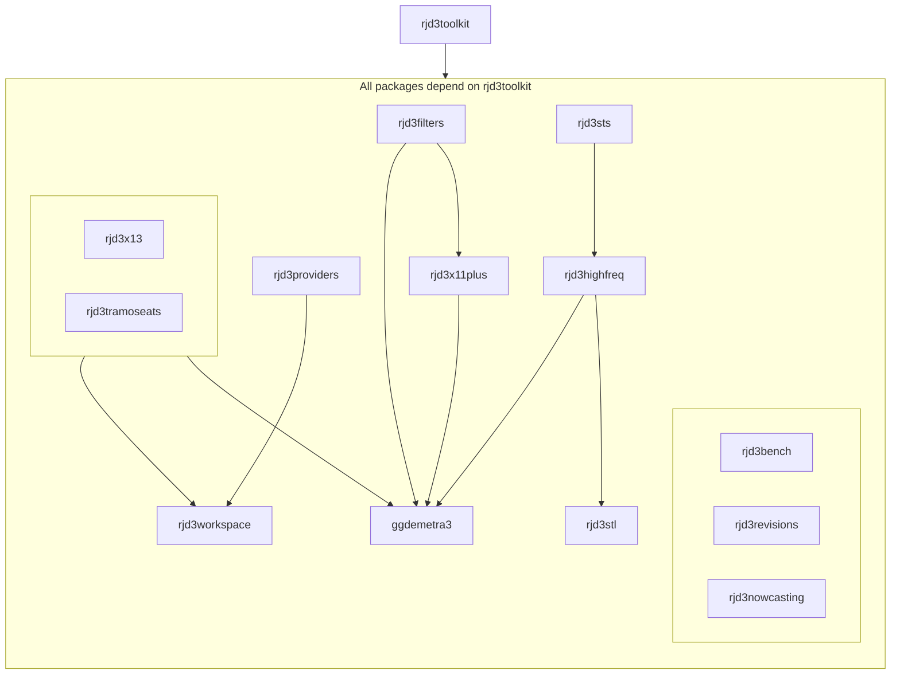

## JDemetra+ R ecosystem
<!--

**Here are some ideas to get you started:**

🙋‍♀️ A short introduction - what is your organization all about?
🌈 Contribution Graphical User Interfacedelines - how can the community get involved?
👩‍💻 Useful resources - where can the community find your docs? Is there anything else the community should know?
🍿 Fun facts - what does your team eat for breakfast?
🧙 Remember, you can do mighty things with the power of [Markdown](https://docs.github.com/github/writing-on-github/getting-started-with-writing-and-formatting-on-github/basic-writing-and-formatting-syntax)
-->

rjdverse is an organization dedicated to creating **R packages giving access to JDemetra+** algorithms. 

[JDemetra+](https://github.com/jdemetra) is a versatile time series analysis software, whose core routines are written in Java and also accessible via a Graphical User Interface (GUI).

[[Documentation]](https://jdemetra-new-documentation.netlify.app/) | [[Blog]](https://jdemetra-universe-blog.netlify.app/)

Installation procedure and basic examples are given in the readme file of each package. Their documentation is available via GitHub pages.

Running rjd3 packages requires **Java 17 or higher**. How to set up such a configuration in R is explained [here](https://jdemetra-new-documentation.netlify.app/#Rconfig) 

Below is the list of R packages available from this page (relying on JDemetra+ core Java libraries) and links to add-on packages:

_**Interface to JDemetra+ v2.x**_

- [RJDemetra](https://github.com/rjdverse/rjdemetra) (Seasonal adjustment with X-13 and Tramo-Seats)

Additional R tools for JDemetra+ v2.x: [rjwsacruncher](https://github.com/AQLT/rjwsacruncher), [JDcruncherR](https://github.com/InseeFr/JDCruncheR), [rjdworkspace](https://github.com/InseeFrLab/rjdworkspace), [ggdemetra](https://github.com/AQLT/ggdemetra), [rjdqa](https://github.com/AQLT/rjdqa), [rjdmarkdown](https://github.com/AQLT/rjdmarkdown)

_**Interfaces to JDemetra+ v3.x**_

**General purpose tools**

- [rjd3toolkit](https://github.com/rjdverse/rjd3toolkit) (Base layer for all other packages,
tests, generating regressors)

- [rjd3sts](https://github.com/rjdverse/rjd3sts) (State Space Framework)

**Seasonal adjustment**

- [rjd3x13](https://github.com/rjdverse/rjd3x13) (Reg-Arima + X11 decomposition)

- [rjd3tramoseats](https://github.com/rjdverse/rjd3tramoseats) (Tramo + SEATS decomposition)

- [rjd3stl](https://github.com/rjdverse/rjd3stl) (Loess based regression decomposition)

- [rjd3highfreq](https://github.com/rjdverse/rjd3highfreq) (Extended airline model + extended AMB decomposition)

- [rjd3x11plus](https://github.com/rjdverse/rjd3x11plus) (Extended X11)
    
**Benchmarking, Temporal disaggregation, Revision analysis and Nowcasting**

- [rjd3bench](https://github.com/rjdverse/rjd3bench) (Benchmarking and Temporal disaggregation)

- [rjd3revisions](https://github.com/rjdverse/rjd3revisions) (Revision analysis)

- [rjd3nowcasting](https://github.com/rjdverse/rjd3nowcasting) (Nowcasting)
    
**Filtering and Trend-cycle Extraction**

- [rjd3filters](https://github.com/rjdverse/rjd3filters)
    
**Tools related to JDemetra+ Graphical User Interface**

- [rjd3providers](https://github.com/rjdverse/rjd3providers) (Wrangling input data for the Graphical User Interface)

- [rjd3workspace](https://github.com/rjdverse/rjd3workspace) (Wrangling workspaces for the Graphical User Interface)

Additional R tools for JDemetra+ v3.x: [rjwsacruncher](https://github.com/AQLT/rjwsacruncher), [ggdemetra3](https://github.com/AQLT/ggdemetra3)

### Dependency relations 

